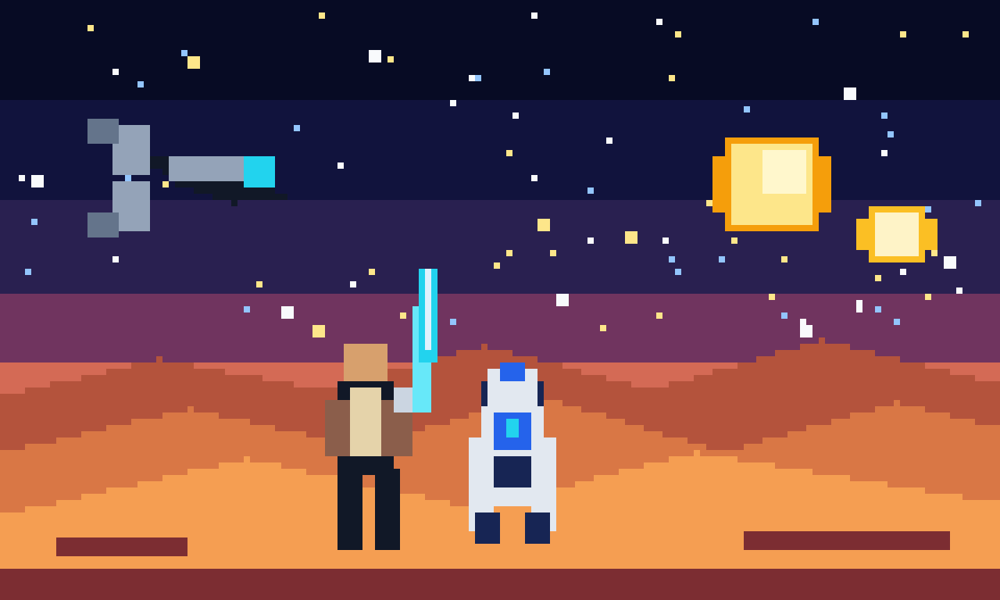

# GPT-Image 2 CLI

🌃 **项目网页：** [lijinzh.github.io/gpt-image-2-cli](https://lijinzh.github.io/gpt-image-2-cli/) · 安装步骤、交互式命令生成器与示例画廊

📚 **完整文档：** [Getting Started](https://lijinzh.github.io/gpt-image-2-cli/getting-started/) · [Using](https://lijinzh.github.io/gpt-image-2-cli/using/) · [Features](https://lijinzh.github.io/gpt-image-2-cli/features/) · [Guides and Tutorials](https://lijinzh.github.io/gpt-image-2-cli/guides/) · [Developer Guide](https://lijinzh.github.io/gpt-image-2-cli/developer-guide/) · [Reference](https://lijinzh.github.io/gpt-image-2-cli/reference/)

> [!TIP]
> **复制下面这一句话给 Codex，即可自动安装和安全配置：**

```text
请从 https://github.com/Lijinzh/gpt-image-2-cli 安装并配置 gpt-image-2-cli，优先读取我本机当前的 CC-Switch Codex 供应商；先运行 gpt-image doctor 和一次不计费的 --dry-run，禁止打印、复制或保存 API Key；如果没有 CC-Switch，就指导我在本机设置 GPT_IMAGE_API_BASE 和 GPT_IMAGE_API_KEY，不要让我在聊天中粘贴 Key；验证成功后告诉我安装位置和一条可直接生成图片的命令。
```

<p align="center">
  
  &nbsp;&nbsp;&nbsp;
  
  &nbsp;&nbsp;&nbsp;
  
</p>

[](https://github.com/Lijinzh/gpt-image-2-cli/actions/workflows/ci.yml)
[](https://github.com/Lijinzh/gpt-image-2-cli/actions/workflows/release.yml)
[](https://lijinzh.github.io/gpt-image-2-cli/)

一个面向 OpenAI 兼容中转站的稳健文生图 CLI。它可以自动读取当前 CC-Switch Codex
供应商，也可以通过环境变量连接任意兼容 API。

项目重点解决旧脚本在大图生成时的几个问题：无法传入横图/竖图尺寸、等待时间太短、
返回大体积 Base64 时缺少校验、只兼容一种响应结构，以及超时后容易误重试并重复计费。

## 🕹️ 直观示例：Star Wars 像素风

<p align="center">
  
</p>

<p align="center"><sub>非官方 Star Wars 致敬像素风示意图，不包含官方 Logo；README 资产可通过 <code>scripts/render_readme_pixel_art.py</code> 复现。</sub></p>

用 CLI 生成属于你自己的 AI 版本：

```powershell
gpt-image generate "Star Wars 宇宙中的 16-bit 像素艺术场景：Luke Skywalker 手持蓝色光剑，与 R2-D2 站在双日落下的沙漠山脊，远处有 X-wing，复古游戏配色，无文字、无 Logo" `
  --size landscape --quality high `
  -o .\artifacts\star-wars-pixel.png
```

更多可直接尝试的提示词：

| 风格 | 提示词 |
| --- | --- |
| 赛博朋克 | `雨夜霓虹街道上的像素风机甲快递员，16-bit RPG 场景，蓝紫配色` |
| 可爱机器人 | `一只在月球泡咖啡的迷你像素机器人，掌机游戏截图风格` |
| 中国科幻 | `长城上空的像素风星舰编队，日出云海，复古街机美术` |

## 特性

- 支持 `1024x1024`、`1536x1024`、`1024x1536`，以及 `square`、`landscape`、
  `portrait` 别名。
- 默认使用 `gpt-image-2`，支持 `quality`、`background` 和一次生成多张图片。
- 自动读取 `~/.cc-switch/cc-switch.db` 中当前 Codex 供应商，不复制、不打印 API Key。
- 也可使用 `GPT_IMAGE_API_BASE` 与 `GPT_IMAGE_API_KEY`，适合 Linux、CI 和其他用户。
- 兼容 `b64_json`、Base64 data URI、HTTP(S) URL、直接图片响应及简单 SSE 响应。
- 生成完成后用 Pillow 验证文件格式和实际像素尺寸，再原子写入目标文件。
- 显式指定尺寸时默认严格拒绝不匹配画布；可用 `--fit-output-size` 主动选择居中裁切并缩放。
- 大图请求默认允许等待 30 分钟，并在等待期间输出心跳。
- 读超时或连接中断后不会自动重试，因为服务端可能已经生成并计费。
- 仅在请求尚未提交的连接建立失败时有限重连；不会重试可能已计费的请求。
- 自动使用显式 `--proxy`、代理环境变量或启用的 Windows 系统代理；可用 `--no-proxy` 禁用。
- 可检测自身版本，并从 GitHub、Gitee、GitCode Release 中选择一致的最新版本。
- 自更新前校验固定仓库、wheel 文件名、文件大小、SHA-256、包名和包内版本。

## 安装

需要 Python 3.11+ 和 [uv](https://docs.astral.sh/uv/)。

推荐从正式 Release wheel 安装。这样 `gpt-image update` 可以确认当前工具由 `uv tool`
管理，并安全替换整个隔离环境：

```powershell
uv tool install "https://github.com/Lijinzh/gpt-image-2-cli/releases/download/v0.2.2/gpt_image_2_cli-0.2.2-py3-none-any.whl"
gpt-image --version
```

GitHub 源码安装仍然可用，但建议正式用户使用 Release wheel：

```powershell
uv tool install "git+https://github.com/Lijinzh/gpt-image-2-cli.git"
```

以上命令在 Windows PowerShell、macOS 和 Linux 的 Bash/Zsh 中均可使用。

## 自动更新

CLI 会在交互式运行 `doctor` 或 `generate` 成功后，最多每 24 小时检查一次正式 Release。
发现更新时，它会下载并完成全部安全校验，然后在当前命令退出后自动更新隔离环境，避免运行
过程中替换自己。下一次调用会直接使用新版，并显示类似提示：

```text
Verified gpt-image 0.3.0 from gitee; it will install automatically after this command exits.
```

脚本或 CI 使用 `--json` 时不会触发自动更新。如需完全关闭低频检查和自动更新，可设置
`GPT_IMAGE_DISABLE_UPDATE_CHECK=1`；仍然可以随时手动运行 `gpt-image update --check`。

只检查版本，不修改安装：

```powershell
gpt-image update --check
gpt-image update --check --json
```

检查、下载并安排在命令退出后安装最新正式版：

```powershell
gpt-image update
```

默认 `--source auto` 会同时检查已配置的 GitHub、Gitee、GitCode Release。它会选择可获得
的最高版本；如果同一版本在多个镜像上的 wheel 大小或 SHA-256 不一致，更新会立即停止，
不会安装任何文件。也可诊断单一源：

```powershell
gpt-image update --check --source github
gpt-image update --check --source gitee
gpt-image update --check --source gitcode
```

更新下载完成后，CLI 会依次验证：HTTPS 和固定仓库边界、预期 wheel 文件名、声明字节数、
SHA-256、wheel 内的包名与版本。验证通过才调用 `uv tool install --force` 原子重建工具环境。
如果当前副本是由系统包管理器、`pipx` 或源码虚拟环境安装，CLI 只会给出对应提示，不会擅自
修改那个环境。

从源码安装或参与开发：

```powershell
git clone https://github.com/Lijinzh/gpt-image-2-cli.git
cd gpt-image-2-cli
uv sync
uv run gpt-image --version
```

## 使用 CC-Switch

先执行不计费检查：

```powershell
gpt-image doctor
gpt-image generate "一辆未来感电动跑车，摄影棚产品照" `
  --size landscape --quality high `
  -o .\artifacts\car.png --dry-run
```

确认后生成横向大图：

```powershell
gpt-image generate "一辆未来感电动跑车，摄影棚产品照" `
  --size 1536x1024 --quality high `
  -o .\artifacts\car.png
```

CLI 默认要求服务端实际返回 `1536x1024`；如果兼容中转偶发返回其他画布，会报错且不覆盖
原文件。确实希望自动得到精确画布时，可显式选择居中裁切和高质量缩放：

```powershell
gpt-image generate "一辆未来感电动跑车，摄影棚产品照" `
  --size 1536x1024 --quality high --fit-output-size `
  -o .\artifacts\car.png
```

代理选择优先级为 `--proxy`、`HTTP_PROXY` / `HTTPS_PROXY` / `ALL_PROXY`、启用的 Windows
系统代理，最后才是直连。`gpt-image doctor --json` 会显示脱敏后的 `proxy_mode` 和代理地址。
如果需要明确覆盖或绕过：

```powershell
gpt-image doctor --proxy http://127.0.0.1:7890
gpt-image doctor --no-proxy
```

竖图：

```powershell
gpt-image generate "雨夜中的未来城市街道，电影感构图" `
  --size portrait --quality high `
  -o .\artifacts\city.png
```

从 UTF-8 文件读取长提示词：

```powershell
gpt-image generate --prompt-file .\prompt.txt `
  --size landscape -o .\artifacts\result.png
```

## 不使用 CC-Switch

PowerShell：

```powershell
$env:GPT_IMAGE_API_BASE = "https://relay.example/v1"
$env:GPT_IMAGE_API_KEY = "your-key"
$env:GPT_IMAGE_MODEL = "gpt-image-2"
gpt-image doctor
```

Bash：

```bash
export GPT_IMAGE_API_BASE="https://relay.example/v1"
export GPT_IMAGE_API_KEY="your-key"
export GPT_IMAGE_MODEL="gpt-image-2"
gpt-image doctor
```

为了避免密钥进入 shell 历史，CLI 不提供 `--api-key` 参数。

## API Key 安全

- 仓库不包含任何真实 API Key，也不会把 Key 写入生成图片或请求元数据。
- 使用 CC-Switch 时，CLI 仅以只读方式从当前用户本机数据库读取当前 Codex 供应商；
  数据库和 Key 不会被复制到项目目录。
- 使用环境变量时，`.env` 和 `.env.*` 默认被 Git 忽略，仓库只保留占位用的
  `.env.example`。
- 错误信息会清理 Bearer Token 和当前 API Key；配置对象的调试表示也不会显示 Key。
- 每位使用者应配置自己的供应商和 Key，不要通过聊天、Issue 或提交记录共享真实 Key。

## 可靠性说明

“请求稳定”和“服务端永不失败”不是一回事。CLI 会尽量兼容常见响应、延长大图等待时间、
验证落盘文件并给出可诊断错误，但无法保证第三方中转站、上游模型或网络永远可用。

如果 POST 请求已经到达服务端后发生读超时，CLI 会明确提示“可能已经计费”，且不会自动
再次提交。确认供应商后台没有生成记录后，再由使用者决定是否重试。

部分兼容中转会在 HTTP 200 响应中包裹 `error` 对象，或忽略请求画布。CLI 会将前者按真实
错误显示，将后者在文件写入前拒绝；两种情况都不会伪装成生成成功。

## 与 Cherry Studio 的兼容依据

实现参考了 Cherry Studio 仓库在提交 `d1ffaa82cec263f7e59d7816f29b078f2da6e1f4`
附近的图像模型配置和兼容补丁，采用了以下行为：

- `gpt-image-2` 的生成尺寸包含 `1024x1024`、`1536x1024` 和 `1024x1536`。
- 对 `gpt-image-*` 兼容路由不主动发送 `response_format`；部分实现会以
  `400 Unknown parameter: 'response_format'` 拒绝它。
- 同时接受 `data[].b64_json`、Base64 data URI、HTTP(S) 图片输出，以及 Cherry 兼容的
  `message.images[].image_url.url` 结构，并在下载完成后统一验证。

本项目是独立的 Python 实现，没有复制 Cherry Studio 的大段源码。

## 项目结构

```text
src/gpt_image_cli/
├── cli.py          # 参数解析和命令编排
├── config.py       # 环境变量与 CC-Switch 只读配置
├── proxy.py        # 显式、环境变量与 Windows 系统代理解析
├── models.py       # 请求参数和结果数据模型
├── responses.py    # JSON、SSE、Base64 和 URL 响应解析
├── client.py       # HTTP 请求、超时和计费风险处理
├── image_io.py     # 图片验证与原子写入
├── updater.py      # Release 多源检查、完整性验证和 uv 自更新
└── errors.py       # 可安全展示的错误与退出码
```

模块按职责分开，但保持单进程、同步调用和少量依赖，便于审查 API Key 流向，也避免为小型
CLI 引入不必要的框架。

## 测试与构建

```powershell
uv run pytest
uv run ruff check .
uv build
```

维护者发布 `vX.Y.Z` 标签后，Release 工作流会测试、构建通用 Python wheel、生成
`latest.json`，再发布到 GitHub Release；配置 `GITEE_TOKEN` / `GITCODE_TOKEN` 后，还会
同步相同资产到对应镜像并做匿名下载校验。镜像仓库尚未创建或没有配置 Token 时，GitHub
Release 仍可独立发布，但相应镜像不会被宣称为已同步。

## 开源与贡献

项目使用 MIT License。欢迎提交 Issue 和 Pull Request；请勿在公开内容中粘贴真实 API
Key、供应商凭据或带鉴权参数的请求地址。开发方式见 [CONTRIBUTING.md](CONTRIBUTING.md)，
安全问题见 [SECURITY.md](SECURITY.md)。
